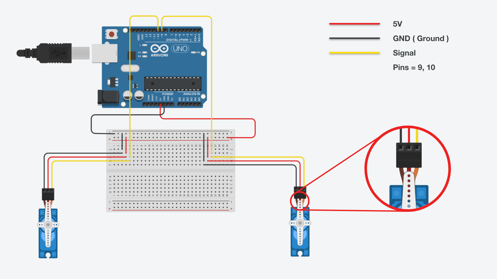

# Introduction

First things first, **this repo is forked from [kiedtl/DinoRun](https://github.com/kiedtl/DinoRun) .**  
this repo make the servos pressing the space key and down key on keyboard, by using : 

 - [Johnny-five](https://github.com/rwaldron/johnny-five) Library to connect my Arduino with Node.js.
 - [Socket.io](https://github.com/socketio/socket.io) Sending Instructions from [Electronjs](https://www.electronjs.org/) to Server.js.

### Regards
A huge thanks to [**Mostafa Fouad**](https://github.com/teefouad), by creating a wonderful article about [**making a T-rex Smart in Google Chrome**](https://medium.com/@TeeFouad/making-the-t-rex-smarter-ebf9aea0660f), also to  [**Kiëd Llaentenn**](https://github.com/kiedtl) for integrating the T-rex in Electronjs, also [**Socket.io Team**](https://github.com/socketio) and [**Rick Waldron
 and his team**](https://github.com/rwaldron).

 # Youtube Video
 You can see my vlog about this repo in this link --> [Video](https://youtu.be/ZEcvsIrnE6o), I do not speak english in this video only Moroccan Language (Darija) the subtitles will be as soon as possible.
 
# How to setup !

You need the following installed on your system to run this:

 1. [Node.js](https://nodejs.org/en/) (LTS OR Current) (I use version v13.5.0)
 2. npm (I use version v6.13.4)

Then run the following commands in your terminal:


```sh
$ git clone https://github.com/yousseffatihi/DinoRun.git
$ cd DinoRun
```

# Installation !
`Note : You must have nodeJS installed in your computer.`

```sh
$ npm install
```
Getting errors try with permission.
```sh
$ sudo npm install
```

# Start !
```sh
$ node server.js
```
then lunch the electron app by the following commands in your terminal .
```sh
$ npm start
```

# Arduino :

Componenets :
  - 1x Arduino Uno
  - 1x Usb Cable
  - 2x Servo
  - At least 6x Pin Cables
  - 1x Board (Optional)

# Snapshot

Arduino Circuit : 

This snapshot designed by [Tinkercad](https://www.tinkercad.com/things/8aU1buNOmLk)

# Arduino Source Code
Steps :
 
 1. Go to Arduino Application -> Examples -> Firmata -> StandardFirmata
 2. Connect your Arduino
 3. Upload
 4. There's no 4th step 3:)